# Database Schema — Enterprise DMS v7.4

PostgreSQL 16 schema for the Document Management System (QMS + ISMS, ISO 9001:2015 / ISO 27001:2022). Generated from `infra/db/init/001_worm_roles.sql` through `013_user_google_calendar_sync.sql`.

**Conventions:**
- All primary keys are `UUID DEFAULT gen_random_uuid()`.
- All tables use `snake_case` columns (EF Core maps them from PascalCase C# properties).
- Tables prefixed `dms_reject_mutation*` triggers enforce **WORM** (Write-Once-Read-Many): `UPDATE`/`DELETE` raise an exception at the DB layer. WORM-protected tables: `dms_audit_trails`, `dms_ocr_indexes`, `dms_esignatures`. (`dms_reminders` originally had a WORM trigger too — removed in migration `011` because reminders are operational, not a compliance ledger.)

---

## Entity-Relationship Diagram

```mermaid
erDiagram
    DMS_USERS ||--o{ DMS_FOLDERS : owns
    DMS_USERS ||--o{ DMS_FOLDER_PERMISSIONS : "granted to"
    DMS_USERS ||--o{ DMS_DOCUMENTS : owns
    DMS_USERS ||--o{ DMS_DOCUMENT_VERSIONS : "checks out / submits / approves"
    DMS_USERS ||--o{ DMS_TASKS : "assigned to / manages"
    DMS_USERS ||--o{ DMS_REMINDERS : receives
    DMS_USERS ||--o{ DMS_ESIGNATURES : signs
    DMS_USERS ||--o{ DMS_WORKFLOW_STEPS : "assigned to / completes"
    DMS_USERS ||--o{ DMS_AUDIT_TRAILS : performs
    DMS_USERS ||--o{ DMS_AUDIT_CALENDAR_EVENTS : posts
    DMS_USERS ||--o| DMS_USER_CALENDAR_CONNECTIONS : connects
    DMS_USERS ||--o{ DMS_USER_CALENDAR_EVENT_SYNCS : syncs

    DMS_FOLDERS ||--o{ DMS_FOLDERS : "parent of"
    DMS_FOLDERS ||--o{ DMS_FOLDER_PERMISSIONS : "secured by"
    DMS_FOLDERS ||--o{ DMS_DOCUMENTS : contains
    DMS_FOLDERS ||--o{ DMS_WORKFLOW_TEMPLATES : scopes
    DMS_FOLDERS ||--o{ DMS_RETENTION_POLICIES : governs

    DMS_DOCUMENTS ||--o{ DMS_DOCUMENT_VERSIONS : "has versions"
    DMS_DOCUMENTS |o--o| DMS_DOCUMENT_VERSIONS : "current version"
    DMS_DOCUMENTS ||--o{ DMS_WORKFLOWS : drives
    DMS_DOCUMENTS ||--o{ DMS_TASKS : "linked to"

    DMS_DOCUMENT_VERSIONS ||--o{ DMS_DOCUMENT_METADATA : describes
    DMS_DOCUMENT_VERSIONS ||--o{ DMS_OCR_INDEXES : "indexed by"
    DMS_DOCUMENT_VERSIONS ||--o{ DMS_ESIGNATURES : signed

    DMS_WORKFLOW_TEMPLATES ||--o{ DMS_WORKFLOWS : instantiates
    DMS_WORKFLOWS ||--o{ DMS_WORKFLOW_STEPS : "made of"
    DMS_WORKFLOW_STEPS ||--o{ DMS_TASKS : "may spawn"

    DMS_TASKS ||--o{ DMS_REMINDERS : triggers

    DMS_AUDIT_CALENDAR_EVENTS ||--o{ DMS_USER_CALENDAR_EVENT_SYNCS : "synced as"

    DMS_USERS {
        uuid user_id PK
        varchar email UK
        varchar full_name
        varchar sso_subject
        bytea mfa_secret
        varchar password_hash "nullable, PBKDF2, null = SSO-only"
        boolean is_active
        timestamptz last_login_at
        timestamptz created_at
        timestamptz updated_at
    }

    DMS_FOLDERS {
        uuid folder_id PK
        uuid parent_folder_id FK "self-reference, ON DELETE CASCADE"
        varchar name "UNIQUE with parent_folder_id"
        text description
        varchar classification "standard/confidential/restricted"
        uuid owner_id FK
        jsonb metadata_schema
        varchar retention_policy "Archive/SoftDelete/WormLock"
        int retention_years
        timestamptz created_at
        timestamptz updated_at
    }

    DMS_FOLDER_PERMISSIONS {
        uuid permission_id PK
        uuid folder_id FK "ON DELETE CASCADE"
        uuid user_id FK "ON DELETE CASCADE"
        varchar role "CHECK: Reader/Writer/Manager/QA/Admin"
        timestamptz granted_at
        uuid granted_by_id FK
    }

    DMS_DOCUMENTS {
        uuid document_id PK
        uuid folder_id FK
        varchar title
        uuid current_version_id FK "points into dms_document_versions"
        varchar tracking_code UK "[DEPT]-[YEAR]-[CATEGORY]-[SEQ]"
        varchar status "draft/pending_approval/released/archived"
        uuid owner_id FK
        timestamptz created_at
        timestamptz updated_at
    }

    DMS_DOCUMENT_VERSIONS {
        uuid version_id PK
        uuid document_id FK "ON DELETE CASCADE, UNIQUE with version_number"
        varchar version_number
        varchar file_name
        bigint file_size_bytes
        varchar mime_type
        varchar s3_object_key UK "MinIO object path"
        varchar sha256_hash
        varchar status "draft/pending_qa/pending_manager/released/archived"
        boolean is_checked_out
        uuid checked_out_by FK
        timestamptz checked_out_at
        text checkout_reason
        uuid submitted_by_id FK
        timestamptz submitted_at
        uuid approved_by_id FK
        timestamptz approved_at
        text approval_comment
        int major_version
        int minor_version
        timestamptz created_at
        timestamptz updated_at
    }

    DMS_DOCUMENT_METADATA {
        uuid metadata_id PK
        uuid version_id FK "ON DELETE CASCADE"
        jsonb custom_data
        timestamptz created_at
    }

    DMS_WORKFLOW_TEMPLATES {
        uuid template_id PK
        uuid folder_id FK "ON DELETE SET NULL"
        varchar name "e.g. C-Doc, PCAR"
        text description
        jsonb steps
        boolean is_active
        timestamptz created_at
    }

    DMS_WORKFLOWS {
        uuid workflow_id PK
        uuid document_id FK "ON DELETE SET NULL"
        uuid task_id "PCAR workflows, not FK-enforced"
        uuid template_id FK
        int current_step_index
        varchar status "active/completed/rejected"
        timestamptz started_at
        timestamptz completed_at
    }

    DMS_WORKFLOW_STEPS {
        uuid step_id PK
        uuid workflow_id FK "ON DELETE CASCADE"
        int step_index
        varchar step_type "qa_pre_check/manager_approval/qa_release/pcar_triage/rca_entry/manager_review"
        uuid assigned_to_id FK
        varchar status "pending/in_progress/completed/skipped"
        text comment
        uuid completed_by_id FK
        timestamptz completed_at
        timestamptz created_at
    }

    DMS_TASKS {
        uuid task_id PK
        uuid workflow_step_id FK "ON DELETE SET NULL"
        uuid document_id FK "ON DELETE SET NULL"
        varchar title
        text description
        varchar task_type "correction/rca/audit_action"
        uuid assigned_to_id FK
        uuid manager_id FK "Track B PCAR"
        varchar risk_severity "Minor/Major/Critical"
        date due_date
        varchar status "open/in_progress/completed/overdue"
        text rca_text
        text preventive_actions
        varchar evidence_url
        uuid completed_by_id FK
        timestamptz completed_at
        timestamptz created_at
        timestamptz updated_at
    }

    DMS_REMINDERS {
        uuid reminder_id PK
        uuid task_id FK "ON DELETE CASCADE"
        uuid recipient_id FK
        varchar reminder_type "CHECK: APP/EMAIL/BOTH"
        timestamptz due_date "was DATE, widened in migration 011"
        boolean is_sent
        timestamptz sent_at
        timestamptz created_at
    }

    DMS_RETENTION_POLICIES {
        uuid policy_id PK
        uuid folder_id FK "ON DELETE CASCADE"
        varchar name
        varchar classification
        varchar action "Archive/SoftDelete/WormLock"
        int retain_years
        boolean is_active
        timestamptz created_at
    }

    DMS_AUDIT_TRAILS {
        uuid log_id PK
        uuid user_id "not FK-enforced, WORM protected"
        varchar action "e.g. DOCUMENT_UPLOADED, USER_DEACTIVATED"
        jsonb metadata
        timestamptz created_at
    }

    DMS_OCR_INDEXES {
        uuid ocr_id PK
        uuid version_id FK "ON DELETE CASCADE, WORM protected"
        text extracted_text "GIN full-text index"
        int page_count
        timestamptz created_at
    }

    DMS_ESIGNATURES {
        uuid signature_id PK
        uuid version_id FK "ON DELETE CASCADE, WORM protected"
        uuid user_id FK
        varchar signature_hash
        jsonb signature_meta "full_name/email/timestamp"
        timestamptz created_at
    }

    DMS_AUDIT_CALENDAR_EVENTS {
        uuid event_id PK
        varchar title
        varchar phase "CHECK: Internal/Stage1/Stage2/Surveillance/Recert/Mgmt Review"
        varchar standard "CHECK: ISO 9001:2015/ISO 27001:2022/Both"
        date event_date
        text notes
        uuid posted_by FK
        timestamptz created_at
    }

    DMS_USER_CALENDAR_CONNECTIONS {
        uuid connection_id PK
        uuid user_id FK "UNIQUE, ON DELETE CASCADE"
        text access_token
        text refresh_token
        timestamptz token_expires_at
        boolean is_active
        timestamptz connected_at
        timestamptz last_synced_at
        text last_sync_error
    }

    DMS_USER_CALENDAR_EVENT_SYNCS {
        uuid sync_id PK
        uuid user_id FK "ON DELETE CASCADE, UNIQUE with event_id"
        uuid event_id FK "ON DELETE CASCADE"
        varchar google_event_id
        timestamptz synced_at
    }
```

---

## Table Groups

### 1. Identity & Access Control
| Table | Purpose |
| :-- | :-- |
| `dms_users` | Accounts. Supports Google Workspace SSO (`sso_subject`) and local password auth (`password_hash`, added in migration `004`, PBKDF2 via `PasswordHasher.cs`). |
| `dms_folders` | Hierarchical folder tree (`parent_folder_id` self-FK), classification, per-folder metadata schema, retention policy defaults. |
| `dms_folder_permissions` | Per-folder, per-user role grants. `role` is constrained (migration `005`) to `Reader / Writer / Manager / QA / Admin` — matches `RBACMiddleware.HasPermissionForMethod()` in the API. |

### 2. Document Management
| Table | Purpose |
| :-- | :-- |
| `dms_documents` | Logical document record. `current_version_id` points at the active row in `dms_document_versions` (circular FK, added after both tables exist via `ALTER TABLE`). `tracking_code` is assigned on release. |
| `dms_document_versions` | Every uploaded revision — file identity (MinIO `s3_object_key`, `sha256_hash`), checkout lock state, and approval workflow fields (submitted/approved by + timestamps) all live here rather than on the parent document. |
| `dms_document_metadata` | Folder-scoped custom key/value data (JSONB) per version. |

### 3. Workflows (C-Doc & PCAR)
| Table | Purpose |
| :-- | :-- |
| `dms_workflow_templates` | Named, reusable step sequences (e.g. "C-Doc", "PCAR"), optionally scoped to a folder. |
| `dms_workflows` | A running instance of a template against a document (or a PCAR `task_id`, not FK-enforced). |
| `dms_workflow_steps` | Ordered steps within a workflow instance — approval gates, QA checks, RCA entry, etc. |

### 4. Tasks & Reminders
| Table | Purpose |
| :-- | :-- |
| `dms_tasks` | Native task tracking for corrections, RCA, and audit actions. Can originate from a workflow step or stand alone. |
| `dms_reminders` | Scheduled nudges tied to a task and recipient. **Not WORM-protected** (fixed in migration `011` — reminders must be mutable to mark sent/deleted; the audit-of-record lives in `dms_audit_trails` instead). |

### 5. Compliance & Audit (WORM-protected)
| Table | Purpose |
| :-- | :-- |
| `dms_audit_trails` | Append-only ledger for every mutating action in the system. `user_id` is not FK-enforced (append-only ledgers should never be blocked by a later user deletion). |
| `dms_ocr_indexes` | Extracted text per document version, GIN-indexed for full-text search. |
| `dms_esignatures` | Digital signature records with a hash + JSON metadata stamp. |

### 6. Retention
| Table | Purpose |
| :-- | :-- |
| `dms_retention_policies` | Per-folder or per-classification retention rules (`Archive` / `SoftDelete` / `WormLock`). |

### 7. ISO Audit Calendar & Google Sync (Session 13+)
| Table | Purpose |
| :-- | :-- |
| `dms_audit_calendar_events` | Persisted ISO audit-journey milestones (Internal Audit → Stage 1/2 → Management Review → Surveillance/Recertification) shown on the Dashboard. |
| `dms_user_calendar_connections` | One row per user who has linked their Google account (OAuth tokens, one connection per user). |
| `dms_user_calendar_event_syncs` | Join table tracking which audit events have been pushed to which user's personal Google Calendar and under what Google event ID (prevents duplicate pushes on re-sync). |

---

## WORM Enforcement Summary

| Table | Trigger function | Status |
| :-- | :-- | :-- |
| `dms_audit_trails` | `dms_reject_mutation()` | ✅ Active (since `001`) |
| `dms_ocr_indexes` | `dms_reject_mutation_ocr()` | ✅ Active (since `002`) |
| `dms_esignatures` | `dms_reject_mutation_esig()` | ✅ Active (since `002`) |
| `dms_reminders` | `dms_reject_mutation_reminders()` | ❌ Removed in `011` — reminders are operational, not a compliance ledger |

Each trigger fires `BEFORE UPDATE OR DELETE` and raises a Postgres exception (`ERRCODE = insufficient_privilege`), rejecting the statement outright. This is layered with MinIO object-lock on the binary objects themselves for the document-version files.

---

## Notable Design Notes

- **Snake_case mapping:** EF Core's `DmsContext.OnModelCreating` applies a global PascalCase → snake_case column-name converter, plus explicit `.ToTable(...)` and `.HasKey(...)` calls per entity, since none of the tables follow EF's naming/PK conventions by default.
- **Scalar FKs only, navigation properties added selectively:** Early sessions kept all models FK-scalar-only (e.g. `DmsTask.AssignedToId` instead of a `DmsUser AssignedTo` nav property). Several navigation properties (`DmsFolderPermission.User/Folder/GrantedBy`, `DmsDocumentVersion.Document/SubmittedBy`, `DmsTask.AssignedTo/Document`, `DmsReminder.Recipient/Task`) were added later, once services needed to project joined data — each addition is paired with explicit Fluent API wiring in `DmsContext`.
- **`checked_out_by` naming gotcha:** the column is `checked_out_by`, not `checked_out_by_id` — it needed an explicit `HasColumnName` override in `DmsContext` because the generic snake_case converter would otherwise produce the wrong name (the Hangfire auto-unlock job silently failed until this was fixed).
- **Free-text vs. constrained enums:** `dms_folder_permissions.role` and `dms_audit_calendar_events.phase/standard` use `CHECK` constraints instead of native Postgres enums or C# enum types, to avoid touching every call site that treats them as plain strings (`RBACMiddleware`, `GrantPermissionRequest`, etc.).
- **Migration files after `002` are incremental ALTERs**, not part of the base schema — Postgres only runs `/docker-entrypoint-initdb.d/*.sql` automatically on a brand-new empty data volume. On an existing volume, each numbered migration must be applied manually against the running container.
